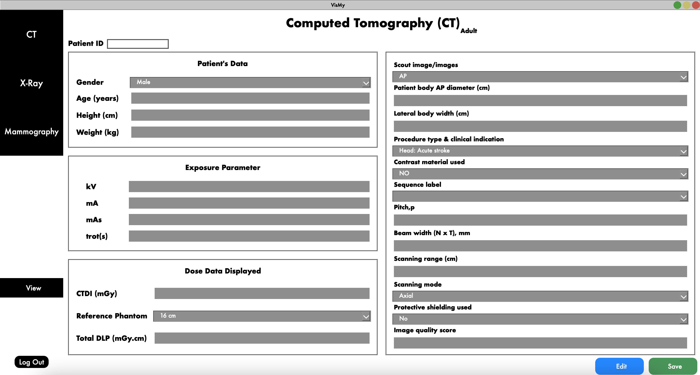

# Medical Dose Data Platform

This is a medical dosage management platform built with **PyQt5** for a responsive, user-friendly desktop interface and **MySQL** for secure, reliable data storage. It enables healthcare providers to accurately record, store and manage patient dosage information with ease.

## Features

- **User-Friendly Interface** – Built with PyQt5 for smooth navigation and intuitive controls.
- **Accurate Dosage Entry** – Structured input forms to minimize human error.
- **Secure Data Storage** – All records stored in a MySQL database.
- **Fast Data Retrieval** – Quickly access patient dosage history.

## Technology Stack

- **Frontend:** PyQt5 (Python)
- **Backend Database:** MySQL
- **Programming Language:** Python 3.x

## Author

Developed by:
- Nurin Syazwina Mohd Haniff
- Siti Fairuz Mat Radzi
